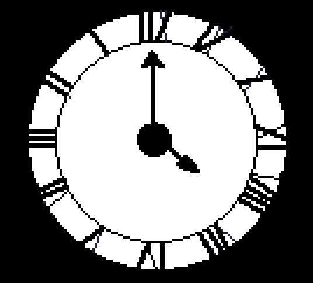

# The man who watches the time pass
The man who watches the time pass is a short narrative game about a man who is in charge of maintaining an old clock in an abandoned village. It takes about 5 min to complete.

Made for Ludum Dare 46, theme: Keep it alive.

You can play it free in itch.io:

https://delarge.itch.io/the-man-who-watches-the-time-pass

Ludum Dare entry:

https://ldjam.com/events/ludum-dare/46/the-man-who-watch-the-time-pass
